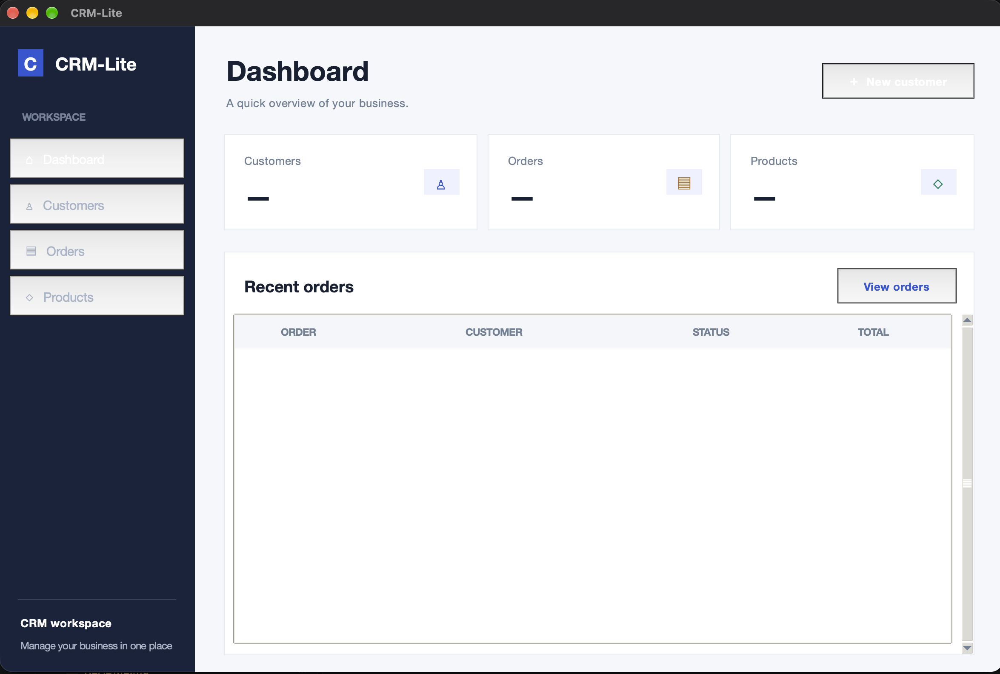

# CRM Lite - Maximize your business




## 1. What is it? 
CRM Lite is a small application that helps businesses track their customers, revenue, orders and many more!

## 2. How to insatll? 
Step 1: If not installed, download Python from [python.org](https://www.python.org/downloads/)

Step 2: Clone this repository in a local folder using the following command:
```
git clone https://github.com/mavromichalis/CRM-Lite.git
```
Step 3: Install dependencies
```
pip install -r requirements.txt
```
Step 4: Inside the root folder of the app, create a `.env` file, by following the instructions from `db/.env.example`.

Step 5: Run commands inside `db/db_init.sql` against your database

Step 6: Run `setup/setup.py` for initial account creation

Step 7: Run `app.py` anytime you want to use the app, logging in with your credentials.

## 3. Current Status:
> Currently, CRM Lite is a Work in Progress (WIP) Project. Bugs may appear. See [Issues](https://github.com/mavromichalis/CRM-Lite/issues) for known issues


## 4. Error Reference

| Error Class | Code | Message | Status Code | Category |
|---|---|---|---:|---|
| `AppError` | `UNKNOWN_ERROR` | An unknown error occurred. | 101 | General |
| `PostgresError` | `DATABASE_ERROR` | Error in your database | 102 | Database |
| `InactiveAccount` | `INACTIVE_ACCOUNT` | Account is not active. | 301 | Authentication |
| `WrongPassword` | `WRONG_PASSWORD` | Wrong Password | 302 | Authentication |
| `UserDoesNotExist` | `USER_NOT_FOUND` | User not found | 303 | User |
| `UsernameTaken` | `USERNAME_TAKEN` | Username Taken | 304 | User |
| `CustomerNotFound` | `CUSTOMER_NOT_FOUND` | Customer not found. | 501 | Customer |
| `ProductNotFound` | `PRODUCT_NOT_FOUND` | Product not found | 401 | Product |
| `NoStockTracking` | `NO_STOCK_TRACKING` | Product does not track stock | 402 | Product / Inventory |
| `SoldOutProduct` | `SOLD_OUT_PRODUCT` | Product sold out | 403 | Product / Inventory |
| `OrderNotFound` | `ORDER_NOT_FOUND` | Order not found. | 601 | Order |

## 5. Notice
CRM Lite is an open source app and does not take responsibility of any problems that might occur because of it's usage.